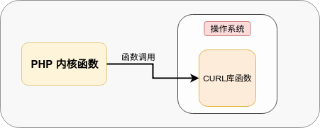

# PHP-CURL连接复用内核原理

## 0.写在前面

PHP是一个时代的产物,它的底层支持是C语言,因此它在CPU密集型计算或者系统内核调用上有天生的优势,Zend引擎把PHP执行生命期分成了五个阶段[^1],这五个阶段并不是全部都能常驻进程,这种模式下,对于很多使用场景会造成不好的影响,比如网络IO.

 对于网络IO中的HTTP请求 , 很多工程师使用 php-curl 系列函数 . 所以这篇文章将从内核角度讲解php如何支持curl请求的连接复用(这里的连接复用也是指在一个RINIT[^2]-->RSHUTDOWN[^3]周期内复用).

## 1. PHP引擎借力CURL库函数

PHP需要使用curl组件进行HTTP系列通信,因此它在底层需要curl有相关的支撑,所以curl首先需要在系统环境中被部署或者被编译,并对外部提供动态链接库文件,PHP通过调用curl相关的动态链接库函数来进行自己内核函数的实现过程.



多说一句,PHP并不一定需要curl才能完成http请求,因为php引擎中已经包含了socket完善的函数库,所以有些php扩展包支持curl和原生stream_socket(tcp)两种模式,例如:**guzzle**

## 2. PHP-CURL基础数据结构(php_curl结构体)

```c
147  typedef struct {
148  	php_curl_write    *write;
149  	php_curl_write    *write_header;
150  	php_curl_read     *read;
151  	zval               std_err;
152  	php_curl_progress *progress;
153  #if LIBCURL_VERSION_NUM >= 0x071500 /* Available since 7.21.0 */
154  	php_curl_fnmatch  *fnmatch;
155  #endif
156  } php_curl_handlers;

173  typedef struct {
174  	CURL                         *cp; //curl库 实体结构体
175  	php_curl_handlers            *handlers; //header 头部
176  	zend_resource                *res; //引擎资源指针
177  	struct _php_curl_free        *to_free;
178  	struct _php_curl_send_headers header;
179  	struct _php_curl_error        err; //错误码
180  	zend_bool                     in_callback;
181  	uint32_t*                     clone;
182  } php_curl;
```


## 3.  透析CURL初始化阶段(curl_init函数)

curl_init是php调用curl的开端,之所以要分析这个函数,因为这个函数中就包括PHP如何调用curl库函数,如何对curl进行参数设置, 代码的解析通过注释的方式 , 内核源码如下:

```c
37  #include <curl/curl.h>  //引入curl库头文件
38  #include <curl/easy.h>

/* {{{ proto resource curl_init([string url])
   Initialize a cURL session */
2019  PHP_FUNCTION(curl_init)
2020  {
2021  	php_curl *ch;
2022  	CURL 	 *cp;
2023  	zend_string *url = NULL;
2024  //解析php函数参数 ,不是必须参数,如果存在则丰富url zend_string(php内核字符串类型)类型指针
2025  	ZEND_PARSE_PARAMETERS_START(0,1)
2026  		Z_PARAM_OPTIONAL
2027  		Z_PARAM_STR(url)
2028  	ZEND_PARSE_PARAMETERS_END();
2029     / *
         * curl_easy_init（）是curl库对外提供的alloc，setup和init的外部函数
         * struct Curl_easy *curl_easy_init(void); /lib/easy.c :381
         * 返回简单的句柄。如果出现任何问题，则返回NULL。
         */
2030  	cp = curl_easy_init();
2031  	if (!cp) { //如果curl初始化失败 则 返回false
2032  		php_error_docref(NULL, E_WARNING, "Could not initialize a new cURL handle");
2033  		RETURN_FALSE;
2034  	}
2035    //这个是核心内存构造函数,主要构造curl句柄的结构指针内存,
2036  	ch = alloc_curl_handle(); 
2037  
2038  	ch->cp = cp;
2039  
2040  	ch->handlers->write->method = PHP_CURL_STDOUT;
2041  	ch->handlers->read->method  = PHP_CURL_DIRECT;
2042  	ch->handlers->write_header->method = PHP_CURL_IGNORE;
2043  
2044  	_php_curl_set_default_options(ch); //初始化CURL对象的默认参数

2045    //如果url指针不为null,则把url参数设置好
2046  	if (url) {
    	/*php_curl_option_url包含: 
    	 1.url解析(php_url_parse_ex) 在(LIBCURL_VERSION_NUM > 0x073800) 支持file://
    	 2.php_curl_option_str --> curl_easy_setopt(ch->cp, option, str);
    	   函数:设置curl句柄的字符串类型参数,在libcurl 7.17.0之后进行url字符串拷贝. 
    		   copystr = estrndup(url, len); 
    	   	   error = curl_easy_setopt(ch->cp, option, copystr);
    	*/
2047  		if (php_curl_option_url(ch, ZSTR_VAL(url), ZSTR_LEN(url)) == FAILURE) {
2048  			_php_curl_close_ex(ch);
2049  			RETURN_FALSE;
2050  		}
2051  	}
2052  /*zval *return_value，我们在函数内部修改这个指针，函数执行完成后，内核将把这个指针指向的zval
        返回给用户端的函数调用者。这种结果值的设计很少见,可以达到很多意想不到的效果,就像这个函数,设置
        完返回值,又可以继续进行相关操作.
        注册ch资源 并 把相关资源指针初始化到返回值内存内.
      */
  //ZEND_API zend_resource* zend_register_resource(void *rsrc_pointer, int rsrc_type);
2053  	ZVAL_RES(return_value, zend_register_resource(ch, le_curl));
2054  	ch->res = Z_RES_P(return_value); //提取资源的指针(在php引擎中是资源id)
2055  }
2056  /* }}} */
```

## 4.  透析CURL参数设置(curl_setopt函数)

php在初始化curl阶段之后,如果初始化成功则会能到一个有效的curl句柄,随后需要对这个curl句柄中的参数进行丰富性设置,下面我们就来看一下内核这部分源代码:

```c
3014  /* {{{ proto bool curl_setopt(resource ch, int option, mixed value)
3015     Set an option for a cURL transfer */
3016  PHP_FUNCTION(curl_setopt)
3017  {
3018  	zval       *zid, *zvalue;
3019  	zend_long        options;
3020  	php_curl   *ch;
3021   /* 解析参数
		* 1.resource : zid
		* 2.long: options
		* 3.zval: zvalue
		*/
3022  	ZEND_PARSE_PARAMETERS_START(3, 3)
3023  		Z_PARAM_RESOURCE(zid)
3024  		Z_PARAM_LONG(options)
3025  		Z_PARAM_ZVAL(zvalue)
3026  	ZEND_PARSE_PARAMETERS_END();
        /*获取资源地址
        * zend_fetch_resource : if(resource_type == res->type){return res->ptr;}
        * 把void* 指针转换为 php_curl* 指针类型
        */
3027    // #define le_curl_name "cURL handle"
3028  	if ((ch = (php_curl*)zend_fetch_resource(Z_RES_P(zid), le_curl_name, le_curl)) == NULL) {
3029  		RETURN_FALSE;
3030  	}
3031    //检查参数 
        //PHP7 删除了CURLOPT_SAFE_UPLOAD选项， 必须使用 CURLFile interface 来上传文件
3032  	if (options <= 0 && options != CURLOPT_SAFE_UPLOAD) {
3033  		php_error_docref(NULL, E_WARNING, "Invalid curl configuration option");
3034  		RETURN_FALSE;
3035  	}
3036    //对ch句柄设置选项对应的参数
3037  	if (_php_curl_setopt(ch, options, zvalue) == SUCCESS) {
3038  		RETURN_TRUE;
3039  	} else {
3040  		RETURN_FALSE;
3041  	}
3042  }
3043  /* }}} */
3044  
```

```c
//这个选项在第五部分会设计,所以单独拿出来, 设置CURL的结果输出类型
2899  case CURLOPT_RETURNTRANSFER:
2900  if (zend_is_true(zvalue)) {
2901  		ch->handlers->write->method = PHP_CURL_RETURN;
2902  } else {
2903  		ch->handlers->write->method = PHP_CURL_STDOUT;
2904  }
2905  break;
```


## 5. 透析CURL的执行过程(curl_exec函数)

当设置好curl参数之后 , 就可以执行curl_exec函数,发出用户请求.

```c
3094  /* {{{ proto bool curl_exec(resource ch)
3095     Perform a cURL session */
3096  PHP_FUNCTION(curl_exec)
3097  {
3098  	CURLcode	error;
3099  	zval		*zid;
3100  	php_curl	*ch;
3101  
3102  	ZEND_PARSE_PARAMETERS_START(1, 1)
3103  		Z_PARAM_RESOURCE(zid)
3104  	ZEND_PARSE_PARAMETERS_END();
3105    //解析并获取php_curl句柄
3106  	if ((ch = (php_curl*)zend_fetch_resource(Z_RES_P(zid), le_curl_name, le_curl)) == NULL) {
3107  		RETURN_FALSE;
3108  	}
3109    /*
		  检验资源所对应的句柄们,ch属于php_curl类型,类型中包含一些读写资源指针,需要对这些资源进行可
          用性判断,根据具体情况更新ch所对应的相应参数.
          */
3110  	_php_curl_verify_handlers(ch, 1);
3111    /*
         由于ch对象能够被复用,所以这部分是对ch进行数据复位工作,主要包括相关缓冲区清空,错误码归置
        */
3112  	_php_curl_cleanup_handle(ch);
3113    /*调用curl库函数进行请求发送
		* curl内核调用关系:curl_easy_perform -->easy_perform-->easy_transfer
        */
3114  	error = curl_easy_perform(ch->cp);
3115  	SAVE_CURL_ERROR(ch, error);
3116  	/* CURLE_PARTIAL_FILE is returned by HEAD requests */
3117  	if (error != CURLE_OK && error != CURLE_PARTIAL_FILE) {
3118  		smart_str_free(&ch->handlers->write->buf);
3119  		RETURN_FALSE;
3120  	}
3121  
3122  	if (!Z_ISUNDEF(ch->handlers->std_err)) {
3123  		php_stream  *stream;
3124  		stream = (php_stream*)zend_fetch_resource2_ex(&ch->handlers->std_err, NULL, php_file_le_stream(), php_file_le_pstream());
3125  		if (stream) {
3126  			php_stream_flush(stream);
3127  		}
3128  	}
3129  /*下面的这部分 就是判断curl的结果该往哪地方输出,有stdout,file,php_var
        */
3130  	if (ch->handlers->write->method == PHP_CURL_RETURN && ch->handlers->write->buf.s) {
3131  		smart_str_0(&ch->handlers->write->buf);
3132  		RETURN_STR_COPY(ch->handlers->write->buf.s);
3133  	}
3134  
3135  	/* flush the file handle, so any remaining data is synched to disk */
3136  	if (ch->handlers->write->method == PHP_CURL_FILE && ch->handlers->write->fp) {
3137  		fflush(ch->handlers->write->fp);
3138  	}
3139  	if (ch->handlers->write_header->method == PHP_CURL_FILE && ch->handlers->write_header->fp) {
3140  		fflush(ch->handlers->write_header->fp);
3141  	}
3142  
3143  	if (ch->handlers->write->method == PHP_CURL_RETURN) {
3144  		RETURN_EMPTY_STRING();
3145  	} else {
3146  		RETURN_TRUE;
3147  	}
3148  }
3149  /* }}} */
```

## 6. 透析CURL的关闭过程

PHP-CURL的过程化解析,最后一部分是关于CURL的关闭阶段,我来分析一下这部分的内核源代码.

```c
3481  /* {{{ proto void curl_close(resource ch)
3482     Close a cURL session */
3483  PHP_FUNCTION(curl_close)
3484  {
3485  	zval		*zid;
3486  	php_curl	*ch;
3487    //解析引擎中资源id
3488  	ZEND_PARSE_PARAMETERS_START(1, 1)
3489  		Z_PARAM_RESOURCE(zid)
3490  	ZEND_PARSE_PARAMETERS_END();
3491    //把void*资源指针转换为 php_curl*指针,如果失败则返回false
3492  	if ((ch = (php_curl*)zend_fetch_resource(Z_RES_P(zid), le_curl_name, le_curl)) == NULL) {
3493  		RETURN_FALSE;
3494  	}
3495    //调用回调函数
3496  	if (ch->in_callback) {
3497  		php_error_docref(NULL, E_WARNING, "Attempt to close cURL handle from a callback");
3498  		return;
3499  	}
3500  //销毁资源
3501  	zend_list_close(Z_RES_P(zid));
3502  }
3503  /* }}} */
3504  

    //销毁zend链表内存,销毁res内存资源
82  ZEND_API int ZEND_FASTCALL zend_list_close(zend_resource *res)
83  {
84  	if (GC_REFCOUNT(res) <= 0) {
85  		return zend_list_free(res);
86  	} else if (res->type >= 0) {
87  		zend_resource_dtor(res);
88  	}
89  	return SUCCESS;
90  }
```

## 7.CURL内核分析

```c
//这部分承载着curl的简单模式下的HTTP请求,curl_exec最终会到这里,当然curl会继续往下走一层,到multi的请求与监控层.
//curl内核调用关系:curl_easy_perform -->easy_perform-->easy_transfer
static CURLcode easy_perform(struct Curl_easy *data, bool events)
{
  struct Curl_multi *multi;
  CURLMcode mcode;
  CURLcode result = CURLE_OK;
  SIGPIPE_VARIABLE(pipe_st);

  if(!data)
    return CURLE_BAD_FUNCTION_ARGUMENT;
    //初始化data的错误buffer
  if(data->set.errorbuffer)
    /* clear this as early as possible */
    data->set.errorbuffer[0] = 0;

  if(data->multi) {
    failf(data, "easy handle already used in multi handle");
    return CURLE_FAILED_INIT;
  }

  if(data->multi_easy)
    multi = data->multi_easy;
  else {
    /* this multi handle will only ever have a single easy handled attached
       to it, so make it use minimal hashes */
    multi = Curl_multi_handle(1, 3);
    if(!multi)
      return CURLE_OUT_OF_MEMORY;
    data->multi_easy = multi;
  }

  if(multi->in_callback)
    return CURLE_RECURSIVE_API_CALL;

  /* Copy the MAXCONNECTS option to the multi handle */
  curl_multi_setopt(multi, CURLMOPT_MAXCONNECTS, data->set.maxconnects);

  mcode = curl_multi_add_handle(multi, data);
  if(mcode) {
    curl_multi_cleanup(multi);
    if(mcode == CURLM_OUT_OF_MEMORY)
      return CURLE_OUT_OF_MEMORY;
    return CURLE_FAILED_INIT;
  }

  sigpipe_ignore(data, &pipe_st);

  /* assign this after curl_multi_add_handle() since that function checks for
     it and rejects this handle otherwise */
  data->multi = multi;

  /* run the transfer */
  result = events ? easy_events(multi) : easy_transfer(multi);

  /* ignoring the return code isn't nice, but atm we can't really handle
     a failure here, room for future improvement! */
  (void)curl_multi_remove_handle(multi, data);

  sigpipe_restore(&pipe_st);

  /* The multi handle is kept alive, owned by the easy handle */
  return result;
}
```

## 8.PHP-HTTP 请求连接复用

PHP的HTTP请求如果想连接复用,这里讨论的连接复用是在一个一般有两种途径:

这里的连接复用也是指在一个RINIT[^2]-->RSHUTDOWN[^3]周期内复用:

1.  借助外部库,复用外部库所创建的实例(类似于PHP的单体), 外部库可以借助curl

2. 借助php内核的**stream_socket_client**的**STREAM_CLIENT_PERSISTENT**

   (可以参考predis源码的src/Connection/StreamConnection.php : 169)

## 9. PHP-CURL组合的HTTP连接复用

通过上面的源码分析,我们可以看出:

* curl_init 阶段会调用curl库创建相关内存区域,
* curl_close阶段会销毁资源

所以 , 在PHP调用curl阶段,我们如果想复用HTTP连接,就必须要把ch改造为单体,不要出现覆盖性创建,也要避免使用curl_close,避免相关资源的销毁,这样复用ch就会复用CURL

虽然复用了CURL,并不能代表能够复用HTTP,因为从源码分析中,我们可以看出http请求是curl帮我们承载的,所以对于连接的管理是curl帮我们做的,根据远端web服务器的http协议,curl会自动判断并选择性的复用连接.

## 10.PHP-Guzzle组合的HTTP复用

对于很多公司使用的是Guzzle功能包丰富和承载HTTP请求,所以我需要对Guzzle的源码做一些解读.

这里我只解析Guzzle的HTTP的handle选择过程.

### 10.1. **Guzzle的Client创建流程 

   ```php
   Client ::__construct()-->HandlerStack::create()-->HandlerStack::choose_handler()
   ```

### 10.2. **choose_handler()函数解析**

   ```php
   function choose_handler()
   {
       $handler = null;
       if (function_exists('curl_multi_exec') && function_exists('curl_exec')) {
           $handler = Proxy::wrapSync(new CurlMultiHandler(), new CurlHandler());
       } elseif (function_exists('curl_exec')) {
           $handler = new CurlHandler();
       } elseif (function_exists('curl_multi_exec')) {
           $handler = new CurlMultiHandler();
       }
   
       if (ini_get('allow_url_fopen')) {
           $handler = $handler
               ? Proxy::wrapStreaming($handler, new StreamHandler())
               : new StreamHandler();
       } elseif (!$handler) {
           throw new \RuntimeException('GuzzleHttp requires cURL, the '
               . 'allow_url_fopen ini setting, or a custom HTTP handler.');
       }
   
       return $handler;
   }
   ```

   **choose_handler函数选择stack中的起始handler，选择策略为：**

   - **扩展自带curl_multi_exec和curl_exec函数则根据$options中的synchronous选项决定，empty(synchronous)为false则使用CurlHandler，否则使用CurlMultiHandler**
   - **扩展只有curl_exec函数则使用CurlHandler**
   - **扩展只有curl_multi_exec函数则使用CurlMultiHandler**

通过分析这部分源代码,我们可以了解**Guzzle也可以通过静态变量的方式来做到复用curl资源,来达到连接复用的目的**.

### 10.3. Guzzle连接复用的样例代码

```php
//为缩减版代码
protected static $guzzleClientConnection = null;

    protected function getGuzzleClient($baseUrl, $persistent = true)
    {
        if (!$persistent || !self::$guzzleClientConnection) {
            self::$guzzleClientConnection = new Client(['base_uri' => $baseUrl]);
        }

        return self::$guzzleClientConnection;
    }

//获取Client静态变量,复用curl单体
  $client = $this->getGuzzleClient($base_uri);
        $headers = [
            'token' => '',
            'Content-Type' => 'application/json',
            'Accept-Encoding' => 'gzip',
        ];

        $responseBody = '';
        $httpCode = '';
        $error = '';

        try {
            $response = $client->request('POST', $func, [
                'headers' => $headers,
                'body' => \GuzzleHttp\json_encode($body),
                'timeout' => $timeout,
                'connect_timeout' => $connectTimeout,
            ]);
            $httpCode = $response->getStatusCode();
            $responseBody = $response->getBody();
        } catch (\Exception $e) {
            $error = $e->getMessage();
        }
```

### 10.4. **上面的guzzle样例是否复用了CURL对象?**

​       这个问题很关键, 因为我们想借助curl的TCP复用,那就必须要成功的在PHP层复用CURL内核对象.

​       我们通过上面的源码分析可以知道PHP内核对于curl内核的创建返回使用的是资源类型进行存储,在PHP内核中,资源有个资源ID进行区分 . 因此我们要想验证上述代码是否成功的复用CURL对象,就需要把CURL对象打印出来.

​       验证上述理论,首先我需要分析一个Guzzle的复用ch对象部分源码:

```php
    //文件: CurlFactory.php
    public function create(RequestInterface $request, array $options)
    {
        if (isset($options['curl']['body_as_string'])) {
            $options['_body_as_string'] = $options['curl']['body_as_string'];
            unset($options['curl']['body_as_string']);
        }

        $easy = new EasyHandle;
        $easy->request = $request;
        $easy->options = $options;
        $conf = $this->getDefaultConf($easy);
        $this->applyMethod($easy, $conf);
        $this->applyHandlerOptions($easy, $conf);
        $this->applyHeaders($easy, $conf);
        unset($conf['_headers']);

        // Add handler options from the request configuration options
        if (isset($options['curl'])) {
            $conf = array_replace($conf, $options['curl']);
        }

        $conf[CURLOPT_HEADERFUNCTION] = $this->createHeaderFn($easy);
        //这部分是对handle进行存在性判断,我们在这里加上一行var_dump
        var_dump($this->handles);
        $easy->handle = $this->handles
            ? array_pop($this->handles)
            : curl_init();
        curl_setopt_array($easy->handle, $conf);

        return $easy;
    }
```

​	我们调整完guzzle代码后,还需要写一份测试代码,测试代码如下:

```php
//GuzzleClient.php
use \GuzzleHttp\Client;
class GuzzleClient
{
    protected static $guzzleClientConnection = null;

    public static function getGuzzleClient($baseUrl, $persistent = true)
    {
        if (!$persistent || !self::$guzzleClientConnection) {
            self::$guzzleClientConnection = new Client(['base_uri' => $baseUrl]);
        }

        return self::$guzzleClientConnection;
    }

}

//get_loop_simple.php 内部循环调用多次
for ($i=0;$i<=10;$i++){
    try {
        //获取Client静态变量,复用curl单体
        $client = GuzzleClient::getGuzzleClient("http://127.0.0.1");
        $response = $client->request('GET', '/test.php');
       // var_dump($response->getBody()->getContents());
    } catch (\Exception $e) {
        $error = $e->getMessage();
        var_dump($error);
    }
}
```

​	我们通过执行上述测试代码可以看到如下的运行结果:

```shell
array(0) {
}
array(1) {
  [0]=>
  resource(44) of type (curl)
}
array(1) {
  [0]=>
  resource(44) of type (curl)
}
array(1) {
  [0]=>
  resource(44) of type (curl)
}
array(1) {
  [0]=>
  resource(44) of type (curl)
}
array(1) {
  [0]=>
  resource(44) of type (curl)
}
array(1) {
  [0]=>
  resource(44) of type (curl)
}
array(1) {
  [0]=>
  resource(44) of type (curl)
}
array(1) {
  [0]=>
  resource(44) of type (curl)
}
array(1) {
  [0]=>
  resource(44) of type (curl)
}
array(1) {
  [0]=>
  resource(44) of type (curl)
}

```

​	**通过上面的运行结果,我们可以除了第一次handle为空,其余每次create过程均没有再次调用curl_init内核函数,而是复用了资源id为44的curl类别资源.**

[^1]: PHP生命期包括: MINIT , RINIT , PHP_EXECUTE_SCRIPT,  RSHUTDOWN , MSHUTDOWN
[^2]: RINIT代表 PHP引擎中的request startup阶段,指请求初始化阶段.
[^3]: RSHUTDOWN代表PHP引擎中的request shutdown阶段,指请求关闭阶段.


李彪

2019年2月21日