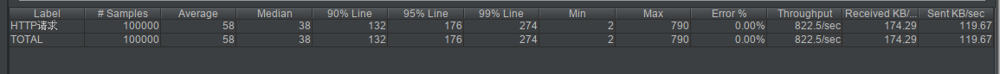
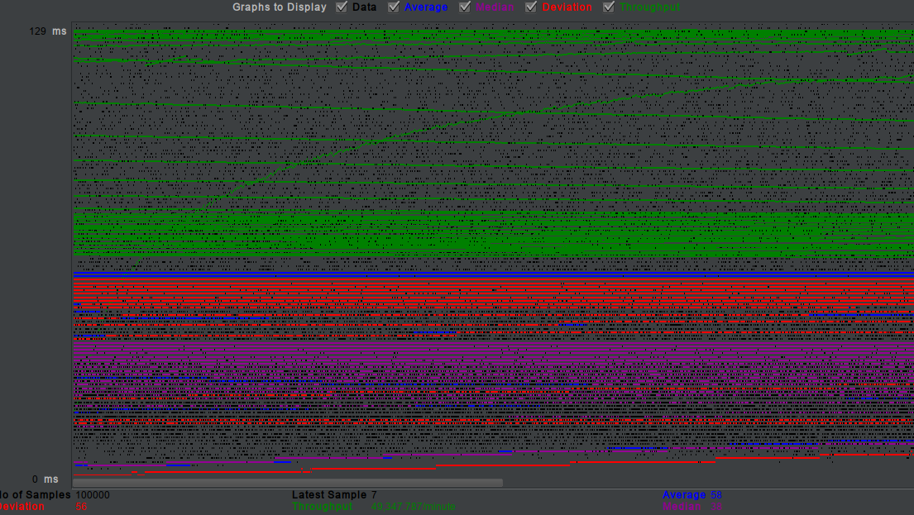

# Curl-VS-Guzzle 性能测试

这里项目围绕Curl 和 Guzzle这两个HTTP请求组件进行一些压力测试,看一下性能差距.我们围绕两个组件的连接复用情况来测试.(**文章中会强调opcache的作用**)

## 一. 测试阐述

1. 测试curl和guzzle在连接复用情况下的性能差别 (guzzle不开启opcache)
2. 测试curl和guzzle在连接复用情况下的性能差别  (guzzle开启opcache)

## 二. 性能测试过程

### 2.1 测试条件
1. 在相同的Nginx,PHP,LibCurl库环境
2. 测试脚本包含curl对象的复用,每次测试请求执行10次外部http请求

### 2.2 Guzzle测试代码 

```php
//GuzzleClient.php
use \GuzzleHttp\Client;
class GuzzleClient
{
    protected static $guzzleClientConnection = null;

    public static function getGuzzleClient($baseUrl, $persistent = true)
    {
        if (!$persistent || !self::$guzzleClientConnection) {
            self::$guzzleClientConnection = new Client(['base_uri' => $baseUrl]);
        }

        return self::$guzzleClientConnection;
    }

}

//get_loop_simple.php 内部循环调用多次
for ($i=0;$i<10;$i++){
    try {
        //获取Client静态变量,复用curl单体
        $client = GuzzleClient::getGuzzleClient("http://127.0.0.1");
        $response = $client->request('GET', '/test.php');
       // var_dump($response->getBody()->getContents());
    } catch (\Exception $e) {
        $error = $e->getMessage();
        var_dump($error);
    }
}
```

### 2.3 Curl测试代码

```php
class CurlClient
{
    protected static $curlClientConnection = null;

    public static function getCurlClient($persistent = true)
    {
        if (!$persistent || !self::$curlClientConnection) {
            self::$curlClientConnection = curl_init();
        }

        return self::$curlClientConnection;
    }

}

//内部循环调用十次
for ($i=0;$i<10;$i++){
    try {
        //获取Client静态变量,复用curl单体
        $ch = CurlClient::getCurlClient();
        curl_setopt($ch, CURLOPT_URL, 'http://127.0.0.1/test.php');

        //return the transfer as a string
        curl_setopt($ch, CURLOPT_RETURNTRANSFER, 1);
        // $output contains the output string
        $response = curl_exec($ch);
        // var_dump($response);
    } catch (\Exception $e) {
        $error = $e->getMessage();
        var_dump($error);
    }
}

```


### 2.4 Guzzle测试结果(复用连接-**没有开启opcache** : 造成大量编译耗时)


### 2.5 Guzzle测试结果(复用连接-**开启opcache** : 消除编译耗时,性能很大提升)


### 2.6 Curl测试结果(复用连接-**开启opcache**)






## 三. 测试总结

**Guzzle由于是PHP包,所以编译代码会消耗时间,但是开启了opcache后,性能不会造成太多损失,能够达到很好的运行性能.**


李彪

2019年2月21日